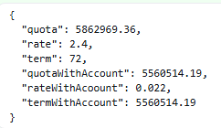

# Calculadora de Créditos – AWS Lambda

Función **AWS Lambda** escrita en **Java 17** que calcula la cuota mensual (*pago*) de un préstamo, con y sin el descuento de tasa que se ofrece a los clientes que ya poseen una cuenta bancaria.

Donde
* **P** – monto del préstamo
* **i** – tasa de interés mensual (forma decimal)
* **n** – número de meses

La lógica reside en la clase `com.CreditCalculatorLambda`.

---

## Requerimientos

* Java 17
* Maven 3.6+
* Cuenta AWS con permisos para desplegar funciones Lambda

---

## Construccion

El JAR listo para desplegar se genera en `target/credit-calculator-lambda-<versión>.jar`.

## Datos

{
"amount": 200000000,
"term": 72,
"rate": 2.4
}

## Resultados

